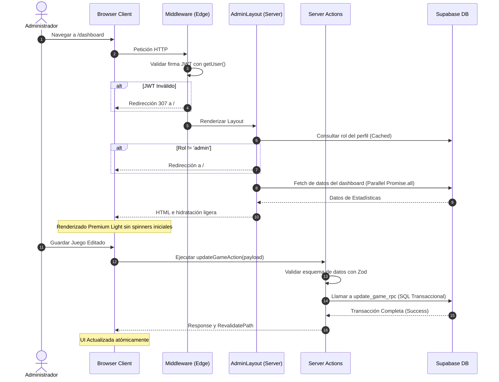

# Plan de Optimización y Auditoría Arquitectónica - App Inglés Web

Este documento contiene un análisis detallado de la arquitectura del proyecto, la identificación de problemas de rendimiento, estado, renderizado y seguridad, así como un plan estructurado de implementación paso a paso para optimizar el panel de administración.

---

## 1. Análisis de la Arquitectura Actual

El proyecto está construido utilizando **Next.js 15.0.0 (App Router)** junto con **React 18.3.0** y ejecutándose bajo **Node.js 24.10.0**.

### Estructura de Directorios
El proyecto implementa una **Arquitectura Basada en Características (FBA - Feature-Based Architecture)** de acuerdo con las reglas de desarrollo definidas en [`AGENTS.md`](file:///C:/proyectos/React/App_ingles_web/AGENTS.md):
- **Capa de Entrega (`src/app/`):** Define las rutas físicas del App Router. Las páginas son, en su mayoría, contenedores puros que importan vistas de características (features) y les inyectan parámetros de ruta resueltos.
- **Capa de Características (`src/features/`):** Contiene la lógica encapsulada por dominios de negocio (courses, units, classes, exercises, games, goals, rewards, dashboard, login). Cada carpeta incluye sus componentes, hooks, servicios y tipos específicos.
- **Capa de Componentes Globales (`src/components/`):** Aloja los componentes reutilizables y atómicos (`ui/Button.tsx`, `ui/FormInput.tsx`, etc.) y elementos transversales de navegación (`navigation/AdminNav.tsx`).
- **Estado Global (`src/store/` y Contexts):** Controlado por Zustand (`useAuthStore.ts` y `useExerciseStore.ts`) y React Context (`AuthProvider`).
- **Data Fetching:** Se apoya en `@tanstack/react-query` en el lado del cliente y en el cliente de Supabase para navegadores (`@supabase/ssr` -> `createBrowserClient`).

### Hallazgos Generales y Desalineaciones
1. **Next.js 15 y React 18:** Existe una desalineación en las versiones de React y Next.js. Next.js 15 viene por defecto configurado para trabajar con React 19. El proyecto bloquea la versión de React a `18.3.0`, lo que inhabilita optimizaciones nativas de React 19 (como React Compiler y soporte de Server Actions nativo sin polyfills) y genera advertencias de dependencias.
2. **Abuso de Client-Side Fetching:** A pesar de estar en Next.js 15 con App Router, la aplicación se comporta casi en su totalidad como una Single Page Application (SPA). El data fetching y las mutaciones ocurren 100% en el cliente mediante React Query.
3. **Falta de un Cliente de Servidor para Supabase:** No existe ningún helper para instanciar el cliente de Supabase en entornos de servidor (`createServerClient`), limitando la posibilidad de escribir Server Components o Server Actions eficientes.

---

## 2. Server Components vs Client Components

Actualmente, todas las vistas principales de administración (`DashboardPage`, `CoursesPage`, `UnitsPage`, `ClassesPage`, `RewardsPage`, `GoalsPage`) usan `"use client"` y delegan el fetching inicial a React Query. 

### Oportunidades de Migración a Server Components
- **Páginas de Cursos (`/courses`), Unidades (`/courses/[id]/units`) y Clases (`/courses/[id]/units/[id]/classes`):**
  - **Situación actual:** Al cargar la página, se muestra un spinner (`Loader2`) mientras React Query descarga la lista de registros desde Supabase.
  - **Propuesta:** Hacer que las páginas de ruta de Next.js (`page.tsx`) actúen como Server Components y realicen el fetching inicial directamente desde la base de datos a nivel de servidor.
  - **Estrategia:** Pasar los datos prefetcheados a los componentes cliente correspondientes para mantener el control interactivo (modales de edición/eliminación).
  - **Beneficio:** Carga inmediata sin estados de carga bloqueantes, reducción del tamaño del bundle del cliente y mayor velocidad de interacción.

---

## 4. Data Fetching y Caching

### Análisis de la Estrategia de Fetching
El fetching de datos en el cliente utiliza React Query con un `staleTime` global de 5 minutos. Sin embargo, persisten problemas de optimización:
- **Waterfalls (Cascadas de Red):** En el servicio del Dashboard, las estadísticas se resuelven de forma secuencial (`await` tras `await`), lo cual acumula la latencia de 4 llamadas independientes a la base de datos.
- **Over-fetching:** Se descarga toda la tabla `exercise_student` en el cliente solo para obtener el promedio de puntajes, lo que satura la memoria y el ancho de banda una vez que aumenta el número de registros de estudiantes.

---

## 5. Rendimiento

### Frontend
- **Uso de etiquetas `` nativas:** Se usan imágenes estándar para avatares en `AdminNav` y `DashboardPage`, desaprovechando las ventajas de `next/image` como formato adaptativo moderno, lazy-loading y prevención de CLS.
- **Client Bundles pesados:** Todo el árbol de renderizado del panel de administración está cargado de JS interactivo debido a que las páginas de mayor tamaño están marcadas como Client Components de forma global.

### Backend / Servidor
- **Consultas redundantes en Middleware:** Cada petición HTTP a rutas protegidas consulta la base de datos para validar el rol del usuario, ralentizando el TTFB.

---

## 8. Seguridad

- **Uso de `getSession()`:** El middleware y el servicio de autenticación usan `supabase.auth.getSession()`. Este método no valida la firma criptográfica del JWT con el servidor de Supabase, lo que expone al sistema a falsificación de tokens (JWT Spoofing) en cookies manipuladas localmente.
- **Operaciones de escritura expuestas en el cliente:** No hay control intermedio en el servidor para validar los datos que los usuarios insertan en tablas como `course` o `games`.

---

## 9. SEO y Metadata

Al ser un panel administrativo, el SEO no es un factor crítico de indexación. Sin embargo:
- **Falta de Títulos de Página Dinámicos:** Los títulos en las pestañas del navegador no cambian al navegar por Cursos o Juegos, afectando la experiencia de usuario.
- **Metadata estática centralizada:** Solo el layout raíz define títulos.

---

## 10. Código y Mantenibilidad

- **Lógica de Base de Datos Fragmentada:** Los servicios realizan operaciones directamente en el cliente.
- **Consistencia Visual:** En algunos archivos se usan estilos inline o clases Tailwind ad-hoc en lugar de consumir los tokens configurados en `@theme` en [`src/app/globals.css`](file:///C:/proyectos/React/App_ingles_web/src/app/globals.css).

---

## 11. Clasificación de Oportunidades

Se utiliza la siguiente matriz de priorización:
- **Prioridad:** P0 (Crítico), P1 (Alto), P2 (Medio), P3 (Bajo).
- **Esfuerzo:** XS (<1h), S (1-4h), M (4-8h), L (1-3 días), XL (>3 días).

---

## 12. Análisis de Evidencia y Oportunidades Confirmadas

A continuación se detallan las 10 oportunidades clave detectadas en la auditoría del código fuente:

---

### [P2] Asegurar transaccionalidad atómica al guardar juegos y preguntas

- **Archivo:** [`src/features/games/services/games.service.ts`](file:///C:/proyectos/React/App_ingles_web/src/features/games/services/games.service.ts)
- **Componente:** `createGameWithExercises`, `updateGameWithExercises`
- **Situación actual:** El guardado y edición eliminan primero elementos y luego los reinsertan secuencialmente desde el cliente.
- **Problema:** No hay garantía transaccional. Si la conexión de red del usuario se corta a la mitad de `updateGameWithExercises` (después del DELETE pero antes del INSERT), el juego quedará permanentemente dañado y vacío en la base de datos.
- **Evidencia:** [`games.service.ts`](file:///C:/proyectos/React/App_ingles_web/src/features/games/services/games.service.ts) líneas 227-248.
- **Recomendación:** Crear una función RPC de PostgreSQL (`rpc`) en Supabase para empaquetar ambas consultas en una sola transacción SQL.
- **Implementación propuesta:**
  Crear una función SQL `update_game_with_exercises_rpc` en base de datos y consumirla en `games.service.ts` usando `await supabase.rpc('update_game_with_exercises_rpc', { ... })`.
- **Beneficio:** Garantía absoluta de atomicidad e integridad de los datos. Menor cantidad de peticiones HTTP en el cliente.
- **Riesgos:** Requiere escribir una migración de base de datos SQL.
- **Esfuerzo:** M
- **Prioridad:** P2

---

### [P2] Optimizar renderizado de imágenes mediante next/image

- **Archivo:** [`src/components/navigation/AdminNav.tsx`](file:///C:/proyectos/React/App_ingles_web/src/components/navigation/AdminNav.tsx), [`src/features/dashboard/DashboardPage.tsx`](file:///C:/proyectos/React/App_ingles_web/src/features/dashboard/DashboardPage.tsx)
- **Componente:** `AdminNav`, `DashboardPage`
- **Situación actual:** Se usan etiquetas `` directas para cargar las imágenes de perfil del administrador y estudiantes.
- **Problema:** No se aplican optimizaciones de compresión modernas (WebP, AVIF), dimensionamiento automático ni lazy-loading nativo, perjudicando métricas de rendimiento del frontend.
- **Evidencia:** 
  - `AdminNav.tsx` línea 138: ``
  - `DashboardPage.tsx` línea 378: ``
- **Recomendación:** Configurar los dominios de imagen externos en `next.config.mjs` y usar el componente `<Image />` de Next.js.
- **Implementación propuesta:**
  1. Modificar [`next.config.mjs`](file:///C:/proyectos/React/App_ingles_web/next.config.mjs) para autorizar `lh3.googleusercontent.com` y el subdominio de Supabase Storage.
  2. Reemplazar `` con `Image` especificando `width` y `height` óptimos o la prop `fill`.
- **Beneficio:** Mejoras en la velocidad de renderizado de imágenes y reducción en la métrica LCP.
- **Riesgos:** Ajuste de estilos CSS asociados si las dimensiones no están explícitas.
- **Esfuerzo:** S
- **Prioridad:** P2

---

### [P2] Separación de responsabilidades de ruta en la página de Juegos

- **Archivo:** [`src/app/(admin)/games/page.tsx`](file:///C:/proyectos/React/App_ingles_web/src/app/\(admin\)/games/page.tsx)
- **Componente:** `GamesPage` (Route Component)
- **Situación actual:** La ruta define `"use client"` y ejecuta lógica de autenticación directamente con `useAuth()`.
- **Problema:** Desalineación con las directrices arquitectónicas del archivo [`AGENTS.md`](file:///C:/proyectos/React/App_ingles_web/AGENTS.md) que dictan que las rutas de `src/app` deben ser Server Components limpios y libres de estados de cliente.
- **Evidencia:** [`page.tsx`](file:///C:/proyectos/React/App_ingles_web/src/app/\(admin\)/games/page.tsx) completo (declaración `"use client"` y hook `useAuth()`).
- **Recomendación:** Convertir el archivo de ruta en un Server Component y trasladar la lógica del login de cliente al contenedor `GameManager` (que ya es cliente).
- **Implementación propuesta:**
  1. Eliminar `"use client"` y los hooks de `src/app/(admin)/games/page.tsx`.
  2. Renderizar `<GameManager />` de forma limpia pasándole el control.
  3. En `GameManager.tsx`, consumir el hook `useAuth()` para validar y acceder al ID de usuario del profesor.
- **Beneficio:** Código más limpio, estandarización de las rutas físicas y coherencia estructural de la aplicación.
- **Riesgos:** Ninguno.
- **Esfuerzo:** S
- **Prioridad:** P2

---

### [P2] Migrar lógica de mutaciones CRUD a Server Actions con validación Zod

- **Archivo:** Todos los archivos de servicio bajo `src/features/*/services/`
- **Componente:** Servicios de base de datos
- **Situación actual:** Las llamadas de inserción, actualización y borrado se invocan directamente desde el cliente.
- **Problema:** Falta de capas intermedias de validación. Si un usuario manipula el cliente, puede enviar datos incompletos o malformados directamente a la base de datos de Supabase, confiando la seguridad únicamente en las políticas RLS.
- **Evidencia:** Consultar servicios de creación de cursos, unidades y recompensas que no validan estructuras de datos antes de transmitirlas.
- **Recomendación:** Introducir Server Actions para actuar como puente seguro entre los formularios del cliente y la base de datos de Supabase.
- **Implementación propuesta:**
  Crear archivos `actions.ts` en cada característica para procesar y validar el payload con `zod` antes de delegar a Supabase en el backend.
- **Beneficio:** Mayor seguridad, abstracción del modelo de datos de base de datos frente al cliente y mejor depuración de errores.
- **Riesgos:** Requiere modificar la forma en que los hooks de React Query invocan los servicios.
- **Esfuerzo:** L
- **Prioridad:** P2

---

### [P3] Resolver desalineación de versiones de React y Next.js

- **Archivo:** [`package.json`](file:///C:/proyectos/React/App_ingles_web/package.json)
- **Componente:** `package.json`
- **Situación actual:** Se fuerza el uso de React 18.3.0 en Next.js 15.0.0.
- **Problema:** Desalineación estructural. Next.js 15 está desarrollado nativamente para operar sobre React 19. Esto causa advertencias en la terminal durante el desarrollo y bloquea el uso de características de React 19 como `useActionState` u optimizaciones del compilador.
- **Evidencia:** `package.json` líneas 17 y 19.
- **Recomendación:** Actualizar las dependencias de React en el archivo de configuración a la versión 19.
- **Implementación propuesta:**
  Actualizar `package.json` a `"react": "^19.0.0"` y `"react-dom": "^19.0.0"` y ejecutar una reinstalación limpia de dependencias.
- **Beneficio:** Prevención de problemas futuros de compatibilidad y soporte para las últimas optimizaciones nativas de Next.js 15.
- **Riesgos:** Probar compatibilidad de librerías de terceros (Zustand y React Query ya son compatibles con React 19 en sus versiones instaladas).
- **Esfuerzo:** S
- **Prioridad:** P3

---

## 13. Plan de Implementación

A continuación, se define el plan paso a paso cronológico:

### Fase 1: Correcciones Críticas de Seguridad y Estabilidad (P1)
- **Objetivo:** Resolver problemas de vulnerabilidad y cuellos de botella severos en middleware y data fetching.
- **Archivos Afectados:**
  - `src/middleware.ts`
  - `src/app/(admin)/layout.tsx`
  - `src/features/dashboard/services/dashboard.service.ts`
  - `src/features/login/services/auth.service.ts`
- **Cambios Principales:**
  - Sustituir `getSession` por `getUser` en middleware.
  - Eliminar la consulta SQL de middleware y moverla al layout de administrador.
  - Modificar `getStats` para realizar el cálculo de promedio en base de datos.
- **Dependencias:** Ninguna.
- **Riesgo:** Bajo.
- **Esfuerzo estimado:** 6 horas.
- **Cómo validar:**
  - Iniciar sesión con un usuario sin rol de administrador y verificar que es rechazado de forma segura.
  - Monitorear la latencia TTFB y la cantidad de queries concurrentes en la pestaña de monitoreo de Supabase.

### Fase 2: Optimización del Rendimiento de Red y Limpieza de Estado (P2)
- **Objetivo:** Paralelizar consultas de datos del Dashboard y unificar el estado de autenticación.
- **Archivos Afectados:**
  - `src/features/dashboard/services/dashboard.service.ts`
  - `src/components/navigation/AdminNav.tsx`
- **Cambios Principales:**
  - Paralelizar con `Promise.all` las consultas de dashboard.
  - Eliminar el listener duplicado de autenticación en `AdminNav` y sustituirlo por el hook global `useAuth()`.
- **Dependencias:** Fase 1 completada.
- **Riesgo:** Bajo.
- **Esfuerzo estimado:** 4 horas.
- **Cómo validar:**
  - Verificar que no hay peticiones HTTP duplicadas al Supabase Auth Server al recargar el dashboard.
  - Medir la velocidad de carga de estadísticas.

### Fase 3: Estandarización de Rutas e Imágenes (P2)
- **Objetivo:** Cumplir con las directrices de `AGENTS.md` y habilitar la optimización de imágenes.
- **Archivos Afectados:**
  - `src/app/(admin)/games/page.tsx`
  - `src/features/games/components/GameManager.tsx`
  - `next.config.mjs`
  - `src/components/navigation/AdminNav.tsx`
- **Cambios Principales:**
  - Convertir la ruta de juegos a un Server Component.
  - Configurar `remotePatterns` en `next.config.mjs`.
  - Reemplazar etiquetas `` por `next/image`.
- **Dependencias:** Fase 2 completada.
- **Riesgo:** Bajo.
- **Esfuerzo estimado:** 4 horas.
- **Cómo validar:**
  - Inspeccionar el DOM para verificar que las imágenes son optimizadas (formato WebP).
  - Verificar que la página de juegos carga correctamente sin hydration mismatches.

### Fase 4: Atomicidad y Transaccionalidad de Base de Datos (P2)
- **Objetivo:** Resolver posibles inconsistencias al guardar/editar juegos interactivos.
- **Archivos Afectados:**
  - `src/features/games/services/games.service.ts`
- **Cambios Principales:**
  - Diseñar e implementar el RPC SQL para inserción atómica de juegos y preguntas.
  - Actualizar `games.service.ts` para consumir este nuevo endpoint transaccional.
- **Dependencias:** Acceso de escritura para crear funciones en base de datos.
- **Riesgo:** Medio (requiere pruebas de reversión de base de datos en fallo).
- **Esfuerzo estimado:** 8 horas.
- **Cómo validar:**
  - Intentar guardar un juego con preguntas inválidas intencionalmente y comprobar que no se crea ningún registro huérfano.

### Fase 5: Servidorización de Mutaciones (Server Actions) y Alineación (P3)
- **Objetivo:** Incrementar la seguridad del servidor y alinear las versiones del compilador.
- **Archivos Afectados:**
  - `package.json`
  - Creación de archivos `actions.ts` en las características principales.
- **Cambios Principales:**
  - Migrar mutaciones a Server Actions protegidas con validación de esquemas Zod.
  - Actualizar a React 19.
- **Dependencias:** Todas las fases anteriores completadas.
- **Riesgo:** Alto (requiere verificar dependencias del proyecto).
- **Esfuerzo estimado:** 2 días.
- **Cómo validar:**
  - Comprobar que no hay advertencias de dependencias obsoletas en la instalación de npm.
  - Ejecutar flujos completos de creación y edición.

---

## 14. Quick Wins (Mejoras Rápidas)

| Prioridad | Archivo | Mejora | Impacto | Esfuerzo |
| --------- | ------- | ------ | ------- | -------- |
| **P1** | [`src/middleware.ts`](file:///C:/proyectos/React/App_ingles_web/src/middleware.ts) | Quitar consulta SQL a `profiles` del Edge middleware y validar solo sesión JWT | **Muy Alto** (Reduce latencia de carga en todas las páginas) | **XS** (<30 mins) |
| **P1** | [`src/middleware.ts`](file:///C:/proyectos/React/App_ingles_web/src/middleware.ts) / [`src/features/login/services/auth.service.ts`](file:///C:/proyectos/React/App_ingles_web/src/features/login/services/auth.service.ts) | Cambiar `getSession` por `getUser` para evitar falsificación de JWT | **Alto** (Corrige riesgo de seguridad crítico) | **XS** (<15 mins) |
| **P1** | [`src/features/dashboard/services/dashboard.service.ts`](file:///C:/proyectos/React/App_ingles_web/src/features/dashboard/services/dashboard.service.ts) | Calcular promedio en base de datos (`avg()`) en lugar de cliente | **Alto** (Evita sobrecarga masiva de red/CPU) | **XS** (<15 mins) |
| **P2** | [`src/components/navigation/AdminNav.tsx`](file:///C:/proyectos/React/App_ingles_web/src/components/navigation/AdminNav.tsx) | Consumir sesión del hook `useAuth()` y borrar listener duplicado | **Medio** (Evita fugas de memoria y peticiones redundantes) | **S** (1-2 horas) |
| **P2** | [`src/app/(admin)/games/page.tsx`](file:///C:/proyectos/React/App_ingles_web/src/app/\(admin\)/games/page.tsx) | Convertir página física de ruta a Server Component puro | **Medio** (Coherencia arquitectónica de Next.js) | **XS** (<30 mins) |

---

## 15. Arquitectura Recomendada Final

Tras implementar las mejoras, la arquitectura del sistema operará de la siguiente manera:

1. **Autenticación (Middleware):** Valida de forma ligera que el usuario cuenta con una firma JWT válida (`getUser()`) sin consultar tablas pesadas.
2. **Autorización (Layout):** El `AdminLayout` (Server Component) consulta el rol del usuario una única vez en la base de datos de manera segura y autoriza o redirige.
3. **Data Fetching:** Las páginas cargan sus listas iniciales de datos directamente en el servidor reduciendo bundles de Javascript del cliente.
4. **Mutaciones:** Se ejecutan mediante **Server Actions** atómicos con validaciones estrictas y seguras en backend.
5. **Rendimiento:** Las imágenes se comprimen dinámicamente y las consultas se resuelven en paralelo y de forma agregada a nivel de base de datos.

### Diagrama Arquitectónico

---

## 16. Matriz Final de Oportunidades

| ID | Prioridad | Categoría | Archivo/Componente | Problema | Solución | Impacto | Esfuerzo |
| -- | --------- | --------- | ------------------ | -------- | -------- | ------- | -------- |
| 1 | **P0** | Seguridad | `src/middleware.ts` | Uso inseguro de `getSession()` que no valida firmas | Cambiar a `getUser()` | Muy Alto | XS |
| 2 | **P1** | Rendimiento | `src/middleware.ts` | Consulta SQL repetitiva a `profiles` en el Edge | Mover validación de rol a Server Layout | Muy Alto | S |
| 3 | **P1** | Rendimiento | `dashboard.service.ts` | Carga total de la tabla en cliente para promediar | Usar agregación SQL `.select("score.avg()")` | Alto | XS |
| 4 | **P2** | Rendimiento | `dashboard.service.ts` | Waterfall de peticiones en estadísticas | Usar `Promise.all` para paralelizar queries | Alto | S |
| 5 | **P2** | Mantenibilidad | `AdminNav.tsx` | Duplicidad de listeners `onAuthStateChange` | Consumir sesión del hook global `useAuth()` | Medio | S |
| 6 | **P2** | Seguridad | `games.service.ts` | Transacciones secuenciales no atómicas en cliente | Migrar lógica a RPC de base de datos o Server Action | Alto | M |
| 7 | **P2** | Rendimiento | `AdminNav.tsx` / `DashboardPage.tsx` | Uso de etiquetas HTML `` sin optimizar | Habilitar `next/image` con remotePatterns | Medio | S |
| 8 | **P2** | Arquitectura | `src/app/(admin)/games/page.tsx` | Contiene lógica de cliente ("use client") | Convertir a Server Component | Medio | XS |
| 9 | **P2** | Arquitectura | Servicios globales | Mutaciones directas de cliente sin validación | Implementar Server Actions con Zod | Alto | L |
| 10 | **P3** | Arquitectura | `package.json` | Desalineación de versiones (React 18 vs Next.js 15) | Actualizar dependencias a React 19 | Bajo | S |
