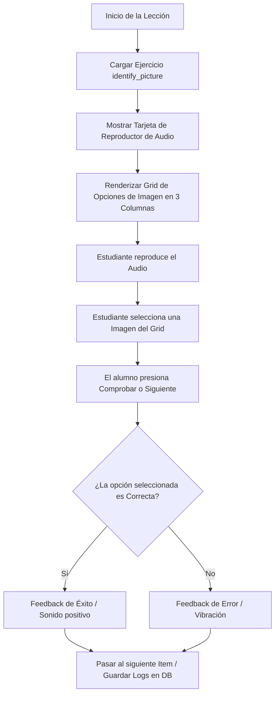

# Plan de Implementación: Consumo de Identify Picture en Cliente Móvil

Este documento define la especificación técnica, arquitectura de datos y requisitos de interfaz para que la aplicación móvil renderice, reproduzca y valide la lección interactiva **Identify Picture** (`identify_picture`) configurada por el profesor.

---

## 🏗️ 1. Estructura de Datos (JSON Schema)

El ejercicio de tipo `identify_picture` se almacena en la tabla `exercise` de Supabase con el campo `type` establecido en `"identify_picture"`. El campo `content` guarda un objeto JSON con la estructura de preguntas (`items`) e imágenes de opción sin etiquetas textuales:

```json
{
  "items": [
    {
      "audio_url": "https://mfczecaialguiktablrz.supabase.co/storage/v1/object/public/exercise-assets/1723812345_audio.mp3",
      "images": [
        {
          "image_url": "https://mfczecaialguiktablrz.supabase.co/storage/v1/object/public/exercise-assets/1723812346_img1.jpg",
          "is_correct": true
        },
        {
          "image_url": "https://mfczecaialguiktablrz.supabase.co/storage/v1/object/public/exercise-assets/1723812347_img2.jpg",
          "is_correct": false
        },
        {
          "image_url": "https://mfczecaialguiktablrz.supabase.co/storage/v1/object/public/exercise-assets/1723812348_img3.jpg",
          "is_correct": false
        }
      ]
    }
  ]
}
```

---

## 🔄 2. Flujo de Experiencia del Alumno

El flujo de interacción del estudiante sigue una secuencia puramente auditiva y visual en la app móvil:



---

## 🎨 3. Requisitos de la Interfaz Móvil (UI/UX)

La pantalla móvil del reproductor debe diseñarse priorizando la accesibilidad táctil, consistencia y una visualización libre de textos innecesarios:

### A. Reproductor de Audio Central
* **Visibilidad Destacada**: Una tarjeta dedicada al audio en la parte superior con un botón de reproducción interactivo grande (`Play/Pause`).
* **Indicadores Visuales**:
  * Barra de progreso horizontal de reproducción del audio.
  * Opcional: Ondas de sonido animadas (Lottie o Canvas reactivo) mientras se reproduce el audio para dar respuesta de que la lección está activa.
* **Control de Audio**: Utilizar librerías nativas del dispositivo para un streaming rápido y manejo de cache local del archivo de audio (`audio_url`).

### B. Cuadrícula de Opciones de Imagen (Grid de 3 Columnas)
* **Maquetación fija**: Renderizar las imágenes en una grilla fija de **3 columnas** para pantallas móviles normales y tablets. Si hay 6 opciones, estas deben alinear perfectamente en **2 filas por 3 columnas**.
* **Sin Etiquetas de Texto**: Está prohibido mostrar nombres, títulos o palabras debajo de las imágenes. El estudiante debe guiarse únicamente por el sonido y la representación visual de la imagen.
* **Aspect Ratio**: Las tarjetas de imágenes deben tener un aspecto cuadrado (`1:1`) o ligeramente horizontal (`4:3`), con bordes suaves y una elevación (sombra) sutil.
* **Feedback Táctil**:
  * Al pulsar una opción, el dispositivo debe generar una microvibración de retroalimentación táctil (*haptic feedback*).
  * La imagen seleccionada se resalta inmediatamente con un borde brillante de color azul/celeste de 3px (`#0EA5E9`) y un check de confirmación en la esquina.

---

## ⚡ 4. Validación de Respuestas y Puntuación

Al finalizar el ejercicio o al presionar el botón de comprobar:

1. **Evaluación**:
   La app localiza el índice de la imagen seleccionada por el estudiante y valida si `is_correct` es `true` dentro del array `images` de la pregunta actual.
2. **Cálculo Proporcional**:
   Si el ejercicio contiene múltiples preguntas (`items`), el puntaje total obtenido se calcula proporcionalmente:
   $$\text{Acierto (\%)} = \left( \frac{\text{Preguntas Correctas}}{\text{Total de Preguntas (Items)}} \right) \times 100$$
   $$\text{Puntos Otorgados} = \text{points\_reward} \times \left( \frac{\text{Acierto (\%)}}{100} \right)$$

---
