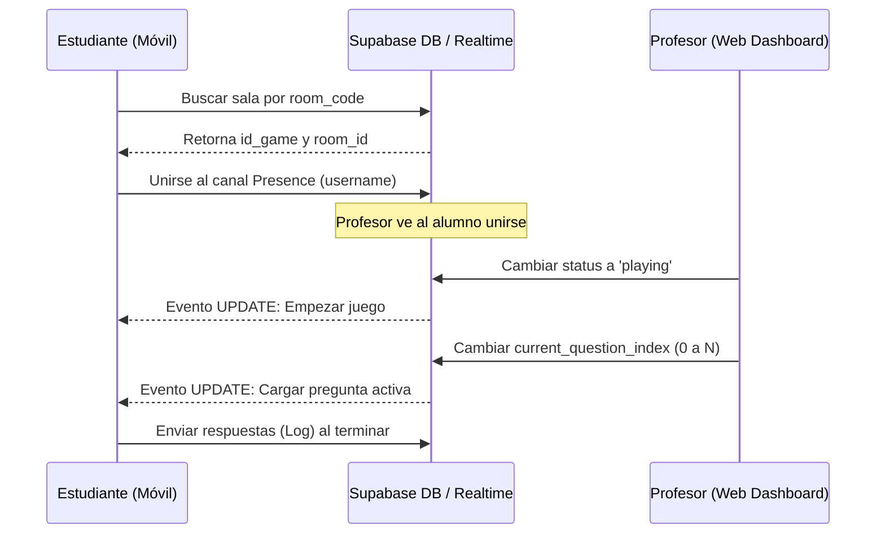

# Guía de Integración para la Aplicación Móvil (Mobile Integration Guide)

Este documento detalla la especificación técnica, estructuras JSON y flujos en tiempo real para que la **aplicación móvil** consuma e implemente los juegos creados desde el panel web.

---

## 🗄️ 1. Esquemas de Datos (Supabase)

La aplicación móvil interactuará con las siguientes tablas mediante la REST API de Supabase y el cliente de Realtime:

### A. Estructuras de las Tablas
1.  **`games`**: Cabecera del juego (`write`, `listen`, `speak`, `mix`).
2.  **`exercise_game`**: Los ejercicios asociados al juego (máximo 8).
3.  **`game_student_log`**: Log enviado por el móvil al completar un juego.
4.  **`game_room`**: Sincronización en tiempo real para el modo multijugador.

---

## 🎯 2. Formato JSON del Campo `content` (exercise_game)

Cada tipo de ejercicio almacena su lógica específica en la columna JSONB `content`. A continuación se describen las estructuras esperadas por el cliente móvil:

### 3.1 WRITTEN (Escritura)

#### A. Match the name to the picture (`match_name_to_picture`)
Muestra una imagen y el estudiante debe seleccionar la palabra correcta de una lista de opciones.
```json
{
  "imageUrl": "https://supabase-storage-url/image.png",
  "options": ["Apple", "Banana", "Orange", "Grape"],
  "correctAnswer": "Apple"
}
```

#### B. Identify the picture reading the name (`identify_picture_reading_name`)
Muestra una palabra de texto y presenta varias opciones de imágenes para que el estudiante elija la correcta.
```json
{
  "wordToRead": "Car",
  "imageOptions": [
    { "id": "opt1", "url": "https://.../car.png", "label": "Car" },
    { "id": "opt2", "url": "https://.../bike.png", "label": "Bike" }
  ],
  "correctAnswer": "Car"
}
```

#### C. Timed typing challenge (`timed_typing_challenge`)
Mecanografía pura: el estudiante debe escribir una serie de palabras exactas en inglés en un lapso de tiempo determinado (hasta 6 palabras).
```json
{
  "words": ["apple", "banana", "cherry", "orange", "lemon", "grape"],
  "timeLimitSeconds": 30
}
```


---

### 3.2 LISTENING (Escucha)

#### A. Listen and match audio to text (`match_audio_to_text`)
El estudiante reproduce un audio y selecciona la opción de texto que corresponde.
```json
{
  "audioUrl": "https://supabase-storage-url/audio.mp3",
  "options": ["Good morning", "Good afternoon", "Good night"],
  "correctAnswer": "Good morning"
}
```

#### B. Fast audio mode (`fast_audio_mode`)
Igual que el anterior, pero el reproductor del móvil debe reproducir el audio a velocidad acelerada (por ejemplo, `1.6x`).
```json
{
  "audioUrl": "https://supabase-storage-url/audio.mp3",
  "options": ["Welcome home", "Come back soon"],
  "correctAnswer": "Welcome home",
  "playbackRate": 1.6
}
```

#### C. Accent recognition challenge (`accent_recognition_challenge`)
El estudiante escucha un audio e identifica a qué acento pertenece (británico, americano, etc.).
```json
{
  "audioUrl": "https://supabase-storage-url/audio_uk.mp3",
  "options": ["British", "American", "Australian"],
  "correctAnswer": "British"
}
```

#### D. Male or female voice (`male_or_female_voice`)
Identificación simple del género de la voz del hablante.
```json
{
  "audioUrl": "https://supabase-storage-url/voice.mp3",
  "options": ["Male", "Female"],
  "correctAnswer": "Female"
}
```

---

### 3.3 SPEAKING (Habla)

#### A. Fluency challenge (`fluency_challenge`)
Terminar una frase con pronunciación perfecta en un lapso de tiempo X.
```json
{
  "phraseToComplete": "As soon as I arrived home, I...",
  "targetPhrase": "As soon as I arrived home, I went straight to sleep.",
  "durationSeconds": 15
}
```

#### B. Speak before timer ends (`speak_before_timer`)
Decir/leer una frase antes de que acaben los 15 segundos como máximo.
```json
{
  "phraseToSpeak": "The quick brown fox jumps over the lazy dog.",
  "durationSeconds": 12
}
```

#### C. Say 5 words quickly (`say_5_words_quickly`)
Decir 5 palabras rápidamente antes de que termine el tiempo.
```json
{
  "words": ["apple", "table", "guitar", "window", "ocean"],
  "durationSeconds": 10
}
```

#### D. Tongue twister challenge (`tongue_twister_challenge`)
Trabalenguas que el estudiante debe leer sin equivocarse, con un límite máximo de intentos/reintentos.
```json
{
  "tongueTwister": "Peter Piper picked a peck of pickled peppers.",
  "durationSeconds": 20,
  "maxAttempts": 3
}
```


---

## ⚡ 3. Flujo Multijugador en Tiempo Real (Kahoot-Style)

Cuando el profesor inicia una sala en la web, el estudiante móvil se conecta a la sala usando el código. El flujo funciona a través de **Supabase Realtime y Presence**:



### Paso 1: Buscar y Obtener la Sala
El móvil consulta la sala activa:
```javascript
const { data: room, error } = await supabase
  .from('game_room')
  .select('*')
  .eq('room_code', inputCode.toUpperCase())
  .single();
```

### Paso 2: Unirse y Registrar Presencia (Presence)
El estudiante debe anunciar su nombre para que aparezca en el proyector del profesor.
```javascript
const roomChannel = supabase.channel(`game_room_presence:${room.id}`);

roomChannel
  .subscribe(async (status) => {
    if (status === 'SUBSCRIBED') {
      // Registra el nombre de usuario
      await roomChannel.track({
        role: 'player',
        username: studentProfile.name
      });
    }
  });
```

### Paso 3: Escuchar Cambios en la Sala (Preguntas Activas)
El móvil debe reaccionar inmediatamente a los cambios iniciados por el profesor:
```javascript
const roomSubscription = supabase
  .channel(`game_room:${room.id}`)
  .on('postgres_changes', { 
    event: 'UPDATE', 
    schema: 'public', 
    table: 'game_room', 
    filter: `id=eq.${room.id}` 
  }, (payload) => {
    const updatedRoom = payload.new;
    
    if (updatedRoom.status === 'playing') {
      // Mostrar la pantalla de juego en el móvil
      const activeQuestionIndex = updatedRoom.current_question_index;
      // Cargar la pregunta activeQuestionIndex de la lista de ejercicios del juego
    }
    
    if (updatedRoom.status === 'finished') {
      // Mostrar pantalla de finalización y podio
    }
  })
  .subscribe();
```

### Paso 4: Registrar Resultados
Al responder o terminar, el móvil registra el puntaje en `game_student_log`:
```javascript
await supabase
  .from('game_student_log')
  .insert({
    id_student_profile: userProfileId,
    id_game: gameId,
    score: finalScore,
    time_spent: durationInSeconds,
    answers_summary: userAnswersArray
  });
```
